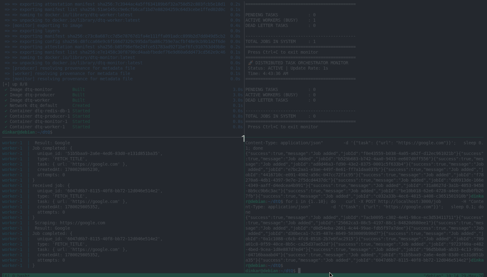

# Distributed Task Queue

A production-style background job processing system built with 
Node.js and Redis. Built to understand how real systems handle 
async work without blocking API responses.

<p align="center">
  
</p>

## What It Does

When a client sends a job via HTTP, the producer pushes it into 
a Redis queue and immediately returns a job ID. A separate worker 
process picks it up, processes it, and tracks its status — 
completely decoupled from the API.

## Features

- **Atomic job pickup** using Redis BLMOVE — if a worker crashes 
  mid-job, the task isn't lost
- **Automatic retries** — failed jobs are re-queued up to 3 times 
  with attempt tracking
- **Dead Letter Queue** — jobs that exhaust all retries are 
  isolated for inspection instead of silently dropped
- **Live CLI monitor** — real-time view of pending, processing, 
  and failed job counts
- **Real task handler** — includes a web scraper that fetches 
  page titles from URLs
- **Docker Compose setup** — spin up the entire stack in one 
  command, scale workers independently

## System Architecture

    **Producer (API)**: Receives requests via HTTP, generates a unique Job ID, and pushes the task to Redis.

    **Redis (Broker)**: Acts as the centralized message broker managing the lifecycle of tasks.

    **Worker**: Pulls tasks atomically, processes them (e.g., Web Scraping), and manages retries/failures.

    **Monitor**: Provides a live view of Pending, In-Progress, and Failed task counts.

## File Structure

```text
DTQ/
├── src/
│   ├── producer.js    # Express API (Entry Point)
│   ├── worker.js      # Background Task Processor
│   ├── monitor.js     # Real-time CLI Dashboard
├── Dockerfile         # App Container Recipe
├── docker-compose.yml # Infrastructure Orchestrator
├── package.json       # Dependencies (ioredis, axios, express)
└── .gitignore         # Prevents pushing node_modules/env
```

## Installation & Setup
*Prerequisites*

    Docker & Docker Compose installed on your machine.

*Running the System*

    Clone the repository:
```bash
git clone https://github.com/your-username/DTQ.git
cd DTQ
```
Start the entire stack (Redis + Producer + Worker + Monitor):
```bash
docker compose up --build -d
```
Scale the Workers (Optional):
To see the system handle high load with 3 parallel workers:
```bash
docker compose up --scale worker=3 -d
```

## Monitoring and Usage
 To see the system in action across multiple terminals:
  In Terminal 2, watch the Dashboard:
  ```bash
  docker compose exec monitor node src/monitor.js
  ```
  In Terminal 3, watch the Worker (Scraping logs):
  ```bash
  docker compose logs -f worker
  ```
  In Terminal 4, send a task using curl:
```bash
for i in {1..10}; do 
  curl -X POST http://localhost:3000/job \
       -H "Content-Type: application/json" \
       -d '{"task": {"url": "https://google.com"}}'
  sleep 0.1
done
```
Watch the Monitor terminal to see the job move from Pending → Active → Completed.

Author: Dinkar Pathak
**Tech Stack**: Node.js, Redis, Docker, Express, Axios.